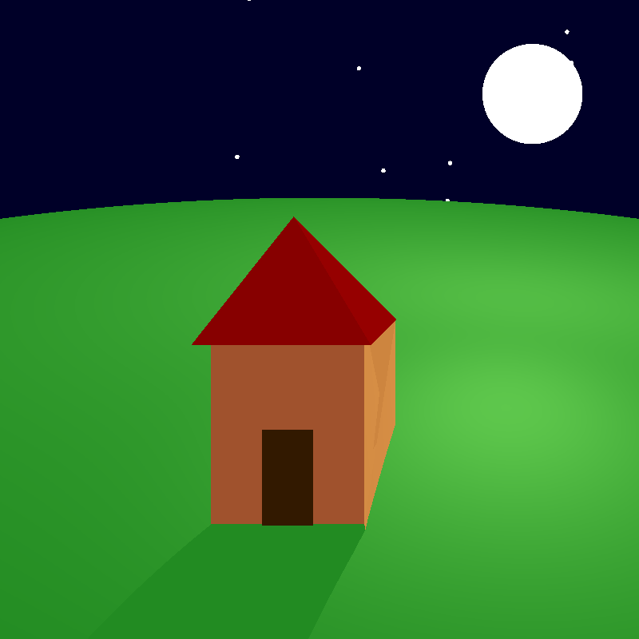
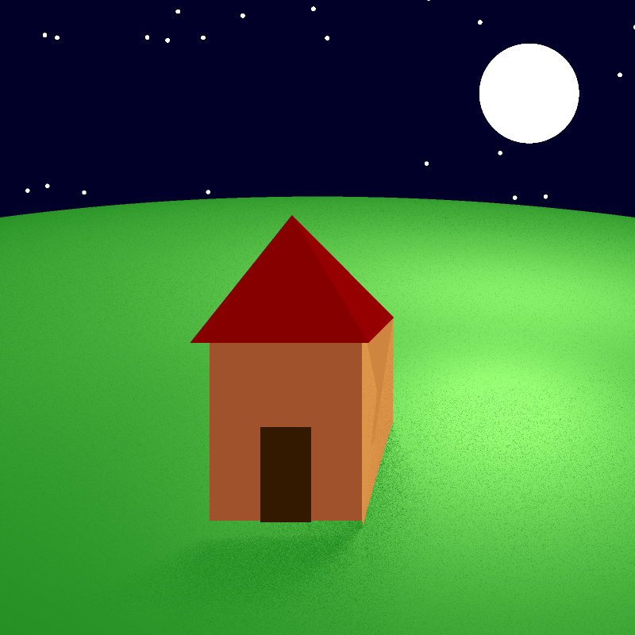
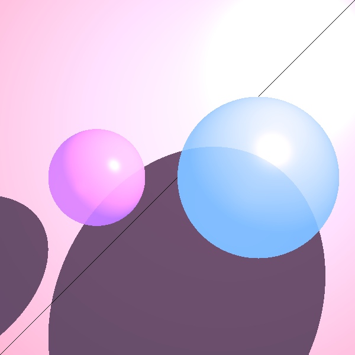
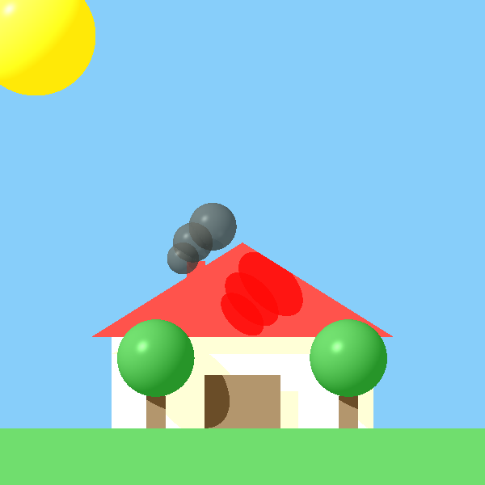

<div dir="rtl">

# 🎨 Mini Ray Tracer — מנוע רינדור תלת-ממדי בג'אווה
### פרויקט ISE5784_3212_6064

> פרויקט סופי בקורס **מבוא להנדסת תוכנה** — בניית מנוע **Ray Tracing** (מעקב קרניים) מאפס בשפת Java,
> הכולל מערכת גאומטריה תלת-ממדית, חישובי תאורה פיזיקליים (מודל פונג), השתקפויות, שקיפות, צללים רכים, אנטי-אליאסינג, דגימה אדפטיבית וריבוי תהליכונים.

**מפתחות:** Isca Fitousi & Avital Orenstin
**שפת פיתוח:** Java
**מתודולוגיה:** **Extreme Programming (XP)** — Pair Programming + **TDD** (Test-Driven Development)
**תבניות עיצוב:** Builder, Composite, NVI, Marker Interface, PDS


## תיאור הפרויקט

הפרויקט מממש **מנוע רינדור גרפי בטכניקת Ray Tracing**, המייצר תמונות תלת-ממדיות פוטו-ריאליסטיות
על ידי שליחת קרניים מהמצלמה דרך כל פיקסל ב"מסך הוירטואלי" (View Plane) אל תוך הסצנה,
חישוב מפגשים עם גופים גאומטריים, וחישוב הצבע הסופי לפי מודל **Phong Reflection Model**
כולל אינטראקציה עם מקורות אור, חומרים, צללים, השתקפויות ושבירת אור.

הפיתוח התבצע ב-**שיטת Pair Programming** במסגרת **Extreme Programming (XP)** —
כל קוד נכתב בזוגות, מבחנים נכתבו לפני המימוש (TDD), והפרויקט פותח באופן **אינקרמנטלי** ב-7 תרגילים + 2 מיני-פרויקטים.

---

## טכנולוגיות וכלי פיתוח

| קטגוריה | כלי / טכנולוגיה |
|---------|------------------|
| שפת תכנות | **Java 17+** |
| סביבת פיתוח (IDE) | **IntelliJ IDEA** |
| בדיקות יחידה | **JUnit 5 (Jupiter)** — בדיקות לפי **EP** (Equivalence Partitions) ו-**BVA** (Boundary Value Analysis) |
| ספריות עזר | JUnit 4, TestNG, Guava, Guice, Hamcrest, SnakeYAML, OpenTest4j |
| בקרת גרסאות | **Git + GitHub** — עם תיוג (Tags) בכל שלב: `PR01`, `PR02`, ..., `PR07.1` |
| מתודולוגיית פיתוח | **Extreme Programming (XP)** + **TDD** + **Refactoring** |
| תיעוד קוד | **JavaDoc** — תיעוד מלא לכל מחלקה ומתודה ציבורית |
| מקביליות | **Java Threads** (ריבוי תהליכונים ב-MP2) |

---

## מבנה הפרויקט

```
ISE5784_3212_6064/
│
├── src/                          ← קוד המקור הראשי
│   ├── primitives/               ← טיפוסי יסוד: Point, Vector, Ray, Color, Material, Double3, Util
│   ├── geometries/               ← גופים: Sphere, Plane, Triangle, Polygon, Cylinder, Tube
│   │                                + Geometry, Intersectable, RadialGeometry, Geometries
│   ├── lighting/                 ← מקורות תאורה: Light, AmbientLight, Directional, Point, Spot + LightSource
│   ├── renderer/                 ← מצלמה, ImageWriter, RayTracerBase, SimpleRayTracer, PixelManager
│   ├── scene/                    ← Scene — תיאור הסצנה (גופים + תאורה + רקע)
│   └── test/                     ← Main של שלב 1 (לדוגמאות התחלתיות)
│
├── unittest/                     ← בדיקות יחידה (JUnit 5)
│   ├── primitives/               ← PointTest, VectorTest, RayTest
│   ├── geometries/               ← לכל גוף + GeometriesTest
│   ├── lighting/                 ← LightTest
│   └── renderer/                 ← CameraTests, RayIntegrationTest, RenderTests,
│                                    ReflectionRefractionTests, ShadowTests, softShadow, ImageWriterTest
│
├── images/                       ← פלטי הרינדור (תמונות PNG שנוצרו)
├── lib/                          ← קבצי JAR חיצוניים (JUnit, Guava, TestNG וכו')
├── out/                          ← תיקיית קומפילציה
└── .idea/                        ← הגדרות IntelliJ
```

---

## 🏛 ארכיטקטורה ועקרונות עיצוב

### תרשים שכבות

```
┌──────────────────────────────────────────────┐
│              שכבת ה-Renderer                  │
│  Camera • SimpleRayTracer • ImageWriter      │
│  PixelManager • paln_board                   │
├──────────────────────────────────────────────┤
│                שכבת ה-Scene                   │
│         Scene (PDS — גופים + תאורה)           │
├──────────────────────────────────────────────┤
│      שכבת ה-Lighting        │   שכבת ה-Geometries   │
│  Ambient/Point/Spot/        │  Composite Pattern:   │
│  Directional Light          │  Geometries + Bodies  │
├──────────────────────────────────────────────┤
│              שכבת ה-Primitives                │
│  Point • Vector • Ray • Color • Material     │
│  Double3 • Util (immutable classes)          │
└──────────────────────────────────────────────┘
```

### תבניות עיצוב (Design Patterns) שמומשו

| תבנית | היכן | מטרה |
|--------|-------|--------|
| **Builder** | `Camera.Builder` | בנייה גמישה ובטוחה של מצלמה עם הרבה פרמטרים אופציונליים |
| **Composite** | `Geometries` |  אוסף של גופים שכולם מממשים `Intersectable` בלי קשר אם הגוף מורכב מכמה גופים |
| **NVI** (Non-Virtual Interface) | `Intersectable.findGeoIntersections` קורא ל-`findGeoIntersectionsHelper` |DRY מתודה כללית שקוראת למתודה פרטית שהמימוש משתנה בין מחלקה למחלקה |
| **Marker Interface** | `Cloneable` ב-`Camera` | סימון לתמיכה ב-`clone()` |
| **PDS** (Plain Data Structure) | `Scene`, `Material`, `GeoPoint` | אוסף של נתונים-מחזיקה את התיאור בלי מתודות |
| **Iterator (foreach)** | מעבר על `Geometries` | שימוש בלולאת `for (... : ...)` `Iterator` במקום ידני |
| **Wrapper** | `primitives.Color` עוטף את `java.awt.Color` |מתאם בין המחלקה הקיימת למחלקה החדשה ומוסיף שכבה בינהם |

### עקרונות עיצוב (Design Principles)

- **DRY** (Don't Repeat Yourself) — שימוש חוזר בקוד (למשל `Ray.getPoint(t)` הופיע פעמיים → חולץ למתודה)
- **KISS** (Keep It Simple, Stupid) — קוד פשוט וקריא
- **YAGNI** (You Aren't Gonna Need It) — אין מתודות "ליתר ביטחון"
- **Law of Demeter** (חוק דמטר) — האצלה (Delegation) במקום שרשרת קריאות עמוקה
- **Immutability** — כל מחלקות ה-Primitives וה-Geometries בלתי-ניתנות לשינוי (`final` fields)
- **SOLID** — הפרדת אחריויות, ירושה ופולימורפיזם נכון

---

## הספריות (Packages) שכתבנו

### 🔹 `primitives` — טיפוסי יסוד
| מחלקה | תפקיד |
|--------|--------|
| `Util` | פונקציות שירות — `isZero`, `alignZero`, `random` (סופק ע"י הקורס, אסור לשנות) |
| `Double3` | שלשת מספרים דצימליים — בסיס ל-Point, Vector, Color (סופק ע"י הקורס) |
| `Point` | נקודה במרחב — בלתי-ניתנת לשינוי, פעולות `add`, `subtract`, `distance`, `distanceSquared` |
| `Vector` | וקטור (יורש מ-`Point`) — `dotProduct`, `crossProduct`, `length`, `lengthSquared`, `normalize`, `scale` |
| `Ray` | קרן — ראש (Point) + כיוון מנורמל (Vector) + `getPoint(t)` + `findClosestPoint` + `findClosestGeoPoint` |
| `Color` |סופק על ידי הקורס עטיפה ל-`java.awt.Color` המאפשרת ערכי RGB בלתי-תחומים |
| `Material` | מאפייני חומר — `kD` (דיפיוזי), `kS` (ספקולרי), `kT` (שקיפות), `kR` (השתקפות), `nShininess` |

### 🔹 `geometries` — גופים גאומטריים

```
Intersectable (abstract — תבנית NVI)
 ├── findGeoIntersections(Ray)                        ← public final
 ├── findGeoIntersectionsHelper(Ray, maxDistance)     ← protected abstract
 └── GeoPoint (PDS פנימי — Geometry + Point)
      │
      ├── Geometry (abstract — מוסיף emission color + material)
      │    ├── RadialGeometry (abstract — מוסיף radius)
      │    │    ├── Sphere
      │    │    ├── Cylinder
      │    │    └── Tube
      │    ├── Plane (נקודה + נורמל)
      │    └── Polygon (אוסף קודקודים + Plane)
      │         └── Triangle (פוליגון עם 3 קודקודים)
      │
      └── Geometries (Composite — אוסף Intersectables)
```

### 🔹 `lighting` — מקורות תאורה
```
Light (abstract — מחזיק intensity)
 ├── AmbientLight                                   (אור סביבתי גלובלי — Iₐ × kₐ)
 ├── DirectionalLight  implements LightSource       (אור כיווני — כמו השמש, ללא דעיכה)
 ├── PointLight        implements LightSource       (אור נקודתי — דעיכה kc + kl·d + kq·d²)
 │    └── SpotLight                                  (פנס מכוון בקונוס — כפול cos(α))
```
ממשק `LightSource` מספק: `getIntensity(Point)`, `getL(Point)`, `getDistance(Point)`.

### 🔹 `renderer` — מנוע הרינדור
| מחלקה | תפקיד |
|--------|--------|
| `Camera` | המצלמה — **Builder Pattern**, מיישמת `Cloneable`, יורה קרניים דרך כל פיקסל |
| `RayTracerBase` | מחלקת בסיס מופשטת למנועי מעקב קרניים |
| `SimpleRayTracer` | המוח שמחשב את הצבע בנקודה |
| `ImageWriter` | כתיבת התמונה ל-PNG (סופק ע"י הקורס) |
| `PixelManager` | ניהול תור הפיקסלים בעבודה מקבילית — **synchronized + volatile** (סופק ע"י הקורס) |
| `paln_board` | מחלק פיקסל לנקודות לפי השיטה שבוחרים |

<div dir="rtl">

### `scene` — תיאור הסצנה

`Scene` היא **PDS** המכילה:
`name`, `background` (`Color`), `ambientLight`,
`geometries`, `lights`.

היא משתמשת ב־**setters** בסגנון Builder
(כל setter מחזיר this)
</div>

## גלריית תמונות

### שיפורים מתקדמים — MP1

#### Before Anti-Aliasing — Soft Shadows 

<p align="center">
  
</p>

#### שילוב שני השיפורים יחד

<p align="center">
  
</p>

### MP2 — Adaptive Super-Sampling

דגימה אדפטיבית: במקום N² קרניים אחידות בכל פיקסל, מתחילים מ-4 פינות ורק אם הצבעים שונים — מחלקים רקורסיבית.

<p align="center">
  
</p>

### 🏠 סצנת הבית — הפרויקט המסכם

הסצנה המסכמת (נדרשת ע"י MP2: מודל תלת-ממד עם **עשרות גופים** ו-**5+ מקורות אור** מסוגים שונים)
מציגה בית עם גג, חלונות, "כוכבים" משתקפים, ומקורות אור מרובים.

#### גרסה ראשונית של הסצנה
<p align="center">
  
</p>

#### השוואה — לפני ואחרי השיפורים

| לפני (ללא שיפורים) | אחרי (עם Anti-Aliasing + Soft Shadows + Adaptive + MT) |
|:------------------:|:----------------------------------------------------:|
|  |  |

---

## ⚙ שיפורי איכות וביצועים — MP1 ו-MP2

### 🎨 MP1 — שיפורי איכות התמונה

#### 1. Anti-Aliasing (החלקת קצוות)
במקום קרן אחת בכל פיקסל, יורים **N×N קרניים** דרך תת-נקודות ברשת הפיקסל וממצעים את הצבעים.
התוצאה: קצוות חלקים ללא "מדרגות".
**המימוש:** `Camera.setAntiAliasing(x, y)` + `paln_board` (חלוקת הפיקסל לרשת).

#### 2. Soft Shadows (צללים רכים)
מקור אור נקודתי מורחב ל-**אזור-אור** (Area Light). במקום קרן צל אחת, נדגמות `Nx × Ny` קרניים מהנקודה אל אזור האור,
ויחס המוצללים → רך.
**המימוש:** `SimpleRayTracer.setNy_NX_of_light(ny, nx)`.

### 🚀 MP2 — שיפורי ביצועים

#### 3. Multi-Threading (ריבוי תהליכונים) — **חובה ב-MP2**
כל תהליכון מושך פיקסל מתוך תור משותף (`PixelManager`) ומעבד אותו במקביל.
**שיפור צפוי:** האצה של ~2.1-2.3 לעומת ריצה סדרתית.
**המימוש:** `Camera.setNumThreads(n)` + `renderImage()` יוצרת `LinkedList<Thread>` ומשתמשת ב-`thread.start()` + `thread.join()`.
**סנכרון:** ב-`PixelManager.nextPixel()` עם `synchronized(mutexNext)` + שדות `volatile`.

#### 4. Adaptive Super-Sampling — השיפור המרכזי של MP2
במקום לדגום N² קרניים בכל פיקסל באופן אחיד, האלגוריתם מתחיל מ-4 פינות הפיקסל,
ורק אם הצבעים שונים — מחלק את הפיקסל רקורסיבית עד עומק `AdaptiveDepth`.
**שיפור צפוי:** פי 5-10 (ללא MT) ופי 10-15 עם MT.
**המימוש:** `Camera.setAdaptive(depth)` + לוגיקה רקורסיבית של חלוקה.

---

## 🚀 כיצד מריצים את הפרויקט

### דרישות מקדימות
- **JDK 17** (או גרסה תואמת)
- **IntelliJ IDEA** (מומלץ) — קובץ `.iml` והגדרות `.idea/` מצורפים
- ספריות מתיקיית `lib/` מוגדרות כתלויות

### הרצת בדיקות
תיקיית `unittest/` מכילה את כל בדיקות ה-JUnit. הקבצים המרכזיים:
- `unittest/renderer/ReflectionRefractionTests.java` — מייצר את כל תמונות הבית והכדורים השקופים/משתקפים.
- `unittest/renderer/ShadowTests.java` — בדיקות צללים.
- `unittest/renderer/RenderTests.java` — בדיקות רינדור בסיסיות.
- `unittest/renderer/softShadow.java` — בדיקות Soft Shadows.

הרצת בדיקה תייצר קובץ PNG בתיקיית `images/` (השם נקבע ע"י `ImageWriter`).

### דוגמת קוד — בניית מצלמה עם כל השיפורים פעילים
```java
Camera camera = Camera.getBuilder()
        .setLocation(new Point(0, 0, 1000))
        .setDirection(new Vector(0, 0, -1), new Vector(0, 1, 0))
        .setVpSize(200, 200)
        .setVpDistance(1000)
        .setImageWriter(new ImageWriter("MyScene", 800, 800))
        .setRayTracer(new SimpleRayTracer(scene)
                .setNy_NX_of_light(9, 9))    // ← Soft Shadows 9×9
        .setAntiAliasing(9, 9)               // ← Anti-Aliasing 9×9
        .setAdaptive(3)                      // ← Adaptive depth = 3
        .setNumThreads(4)                    // ← 4 תהליכונים
        .build();

camera.renderImage();
camera.writeToImage();
```

---

## 📝 הערות סיום

הפרויקט פותח לאורך סמסטר שלם ב-**שיטת Pair Programming** במסגרת **Extreme Programming (XP)**,
עם דגש על **TDD** — בכל שלב נכתבו תחילה הבדיקות (לפי EP + BVA), ורק לאחר מכן המימוש.
הקוד תועד בקפדנות בפורמט **Javadoc**, ולאורך הדרך בוצעו **Refactorings** רבים לשמירה על עקרונות
DRY, KISS, YAGNI וחוק דמטר.

כל קומיט סומן ב-Git ב-**תג מתאים** (`PR01`, `PR02`, ..., `PR07.1`) בסיום כל שלב.

תודה לצוות הקורס על הליווי והאתגרים המעניינים לאורך הסמסטר. 💜

— **Isca Fitousi & Avital Orenstin**

</div>
