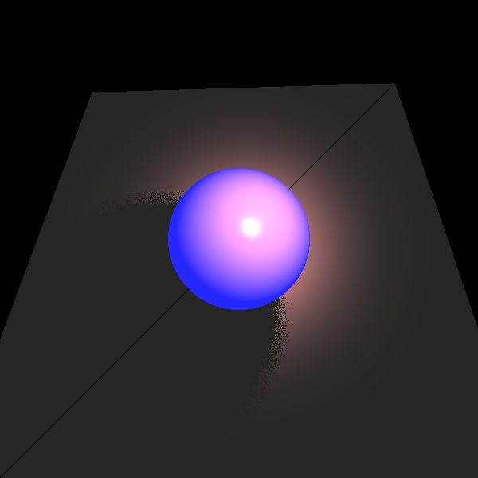
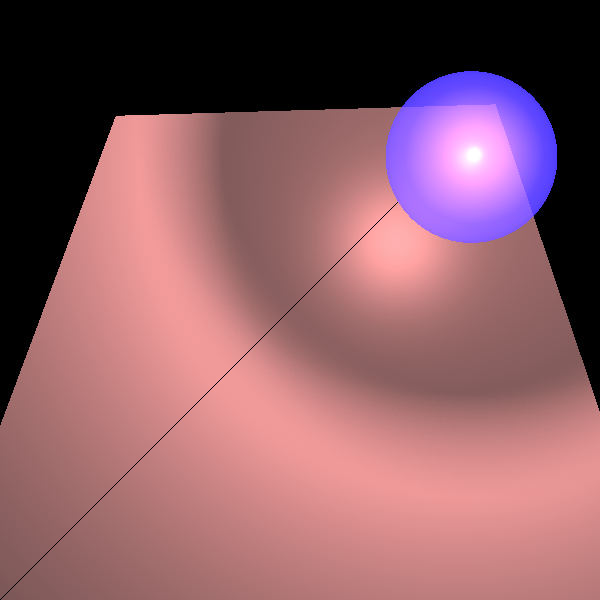
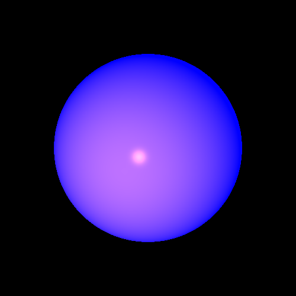
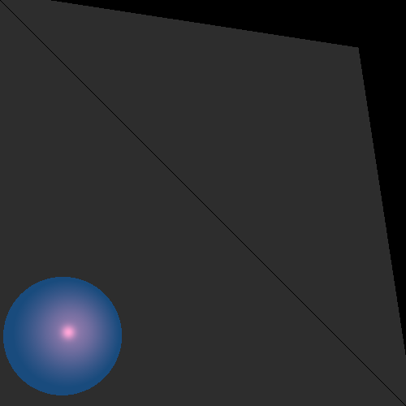
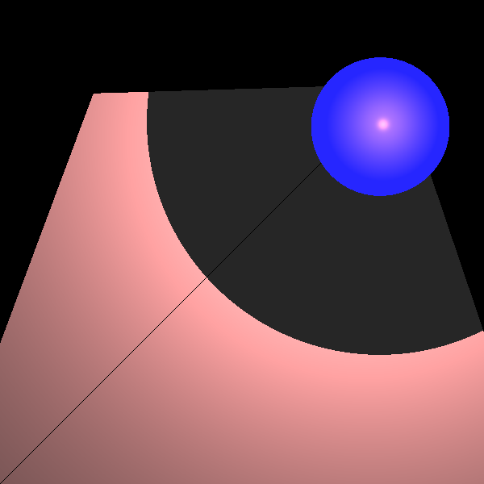
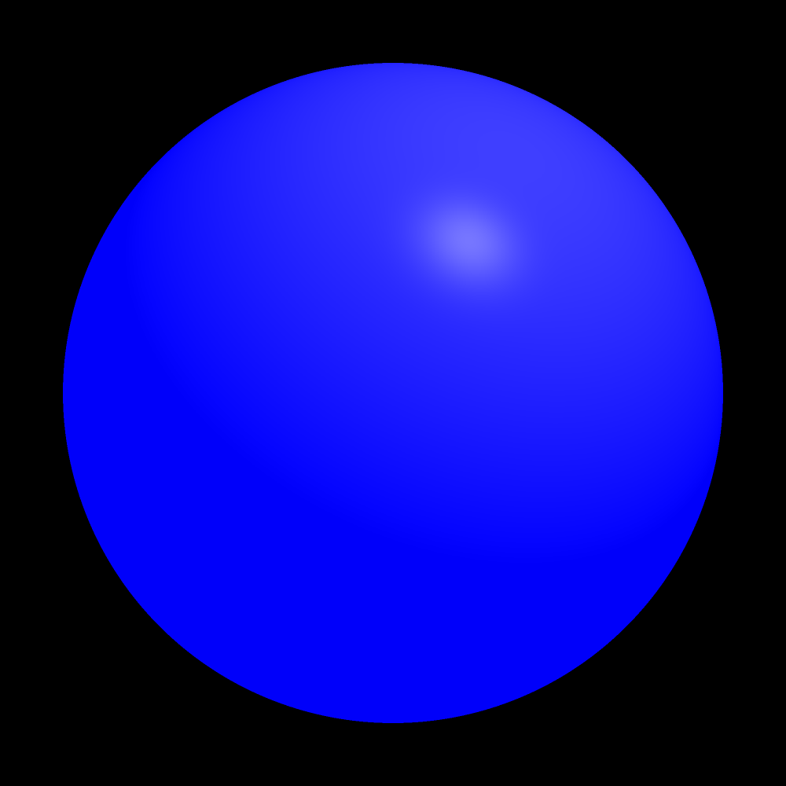
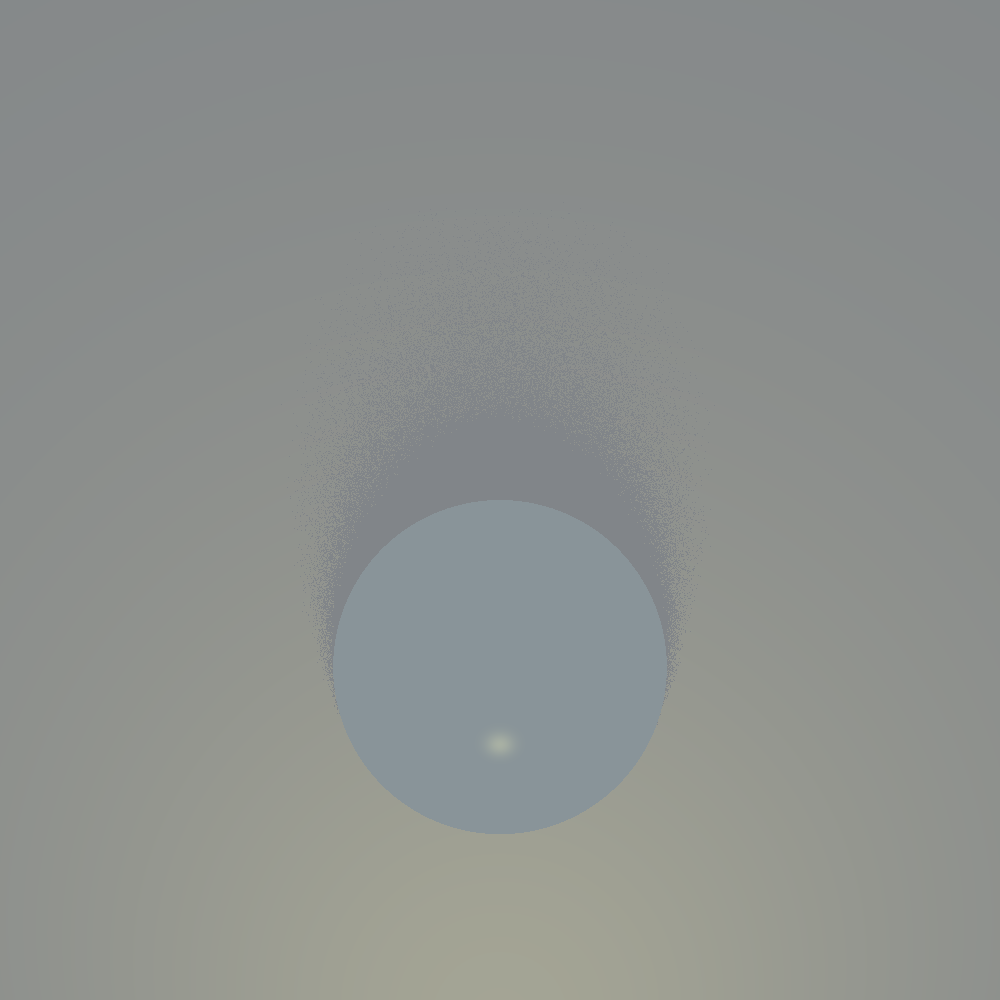
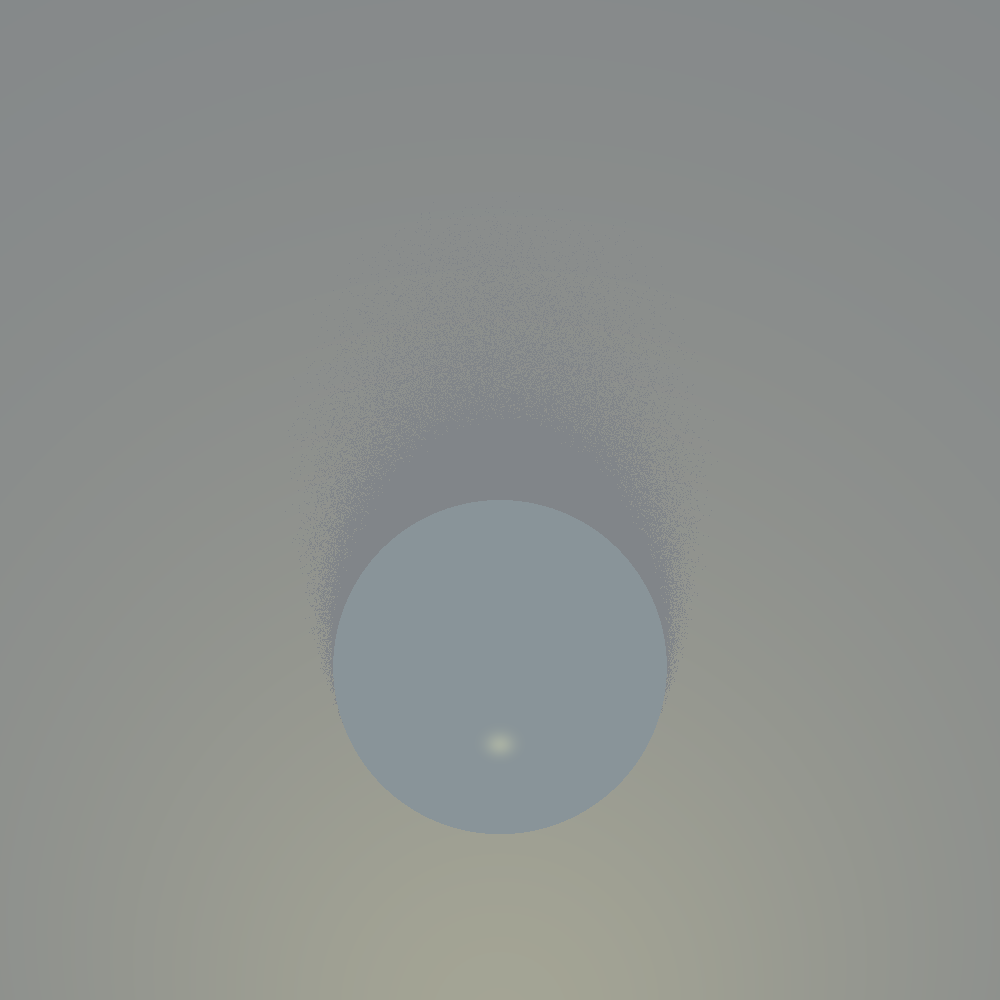
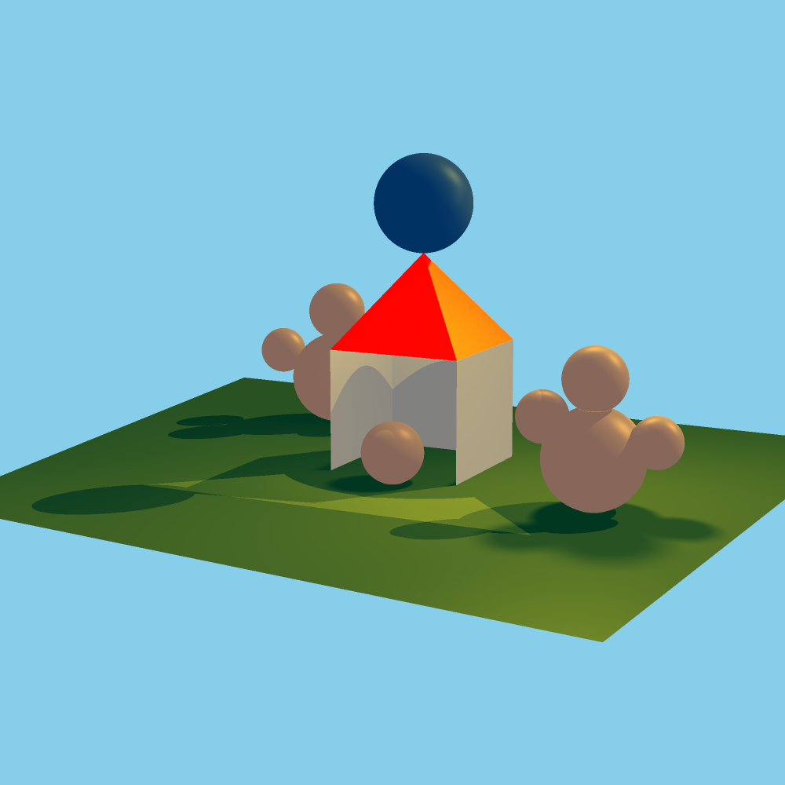

<div dir="rtl">

# 🎨 Mini Ray Tracer — מנוע רינדור תלת-ממדי בג'אווה
### פרויקט ISE5784_3212_6064

> פרויקט סופי בקורס הנדסת תוכנה — בניית מנוע **Ray Tracing** (מעקב קרניים) מאפס בשפת Java,
> הכולל מערכת גאומטריה תלת-ממדית, חישובי תאורה פיזיקליים, השתקפויות, שקיפות, צללים רכים, אנטי-אליאסינג וריבוי תהליכונים.

**מפתחות:** Isca Fitousi & Avital Orenstin
**שפת פיתוח:** Java
**מתודולוגיה:** TDD (Test-Driven Development) + Design Patterns (Builder)

---

## 📑 תוכן עניינים

1. [תיאור הפרויקט](#-תיאור-הפרויקט)
2. [טכנולוגיות וכלי פיתוח](#-טכנולוגיות-וכלי-פיתוח)
3. [מבנה הפרויקט](#-מבנה-הפרויקט)
4. [ארכיטקטורה ועקרונות עיצוב](#-ארכיטקטורה-ועקרונות-עיצוב)
5. [הספריות (Packages) שכתבנו](#-הספריות-packages-שכתבנו)
6. [שלבי הפרויקט](#-שלבי-הפרויקט)
7. [גלריית תמונות וקובץ פלט](#-גלריית-תמונות-וקובץ-פלט)
8. [שיפורי איכות וביצועים](#-שיפורי-איכות-וביצועים)
9. [כיצד מריצים את הפרויקט](#-כיצד-מריצים-את-הפרויקט)

---

## 🌟 תיאור הפרויקט

הפרויקט מממש **מנוע רינדור גרפי בטכניקת Ray Tracing**, המייצר תמונות תלת-ממדיות פוטו-ריאליסטיות
על ידי שליחת קרניים מהמצלמה דרך כל פיקסל ב"מסך הוירטואלי" אל תוך הסצנה,
חישוב מפגשים עם גופים גאומטריים, וחישוב הצבע הסופי לפי מודל פאונג (Phong Reflection Model)
כולל אינטראקציה עם מקורות אור, חומרים, צללים, השתקפויות ושבירת אור.

בנוסף למימוש הבסיסי, הפרויקט כולל מספר **שיפורים מתקדמים**:
*Anti-Aliasing*, *Soft Shadows*, *Adaptive Super-Sampling* ו-*Multi-Threading*.

---

## 🛠 טכנולוגיות וכלי פיתוח

| קטגוריה | כלי / טכנולוגיה |
|---------|------------------|
| שפת תכנות | **Java 17+** |
| סביבת פיתוח (IDE) | **IntelliJ IDEA** |
| בדיקות יחידה | **JUnit 5 (Jupiter)**, JUnit 4, TestNG |
| ספריות עזר | Guava, Guice, Hamcrest, SnakeYAML, OpenTest4j |
| בקרת גרסאות | **Git** |
| מתודולוגיית פיתוח | **TDD** (פיתוח מונחה בדיקות) |
| תבנית עיצוב מרכזית | **Builder Pattern** (במחלקת `Camera`) |
| מקביליות | **Java Threads** (ריבוי תהליכונים) |

---

## 📂 מבנה הפרויקט

```
ISE5784_3212_6064/
│
├── src/                          ← קוד המקור הראשי
│   ├── primitives/               ← טיפוסי יסוד: נקודה, וקטור, קרן, צבע, חומר
│   ├── geometries/               ← גופים גאומטריים: ספירה, מישור, משולש, פוליגון, גליל, צינור
│   ├── lighting/                 ← מקורות תאורה: אמביינט, נקודתי, כיווני, ספוטלייט
│   ├── renderer/                 ← מצלמה, רושם תמונה, מנוע מעקב קרניים, ניהול פיקסלים
│   ├── scene/                    ← תיאור הסצנה (Scene)
│   └── test/                     ← מחלקת Main לדוגמאות שלב 1
│
├── unittest/                     ← בדיקות יחידה (JUnit)
│   ├── primitives/               ← בדיקות לטיפוסי היסוד
│   ├── geometries/               ← בדיקות לגאומטריות
│   ├── lighting/                 ← בדיקות לתאורה
│   └── renderer/                 ← בדיקות אינטגרציה, השתקפויות, צללים, רינדור
│
├── images/                       ← פלטי הרינדור (תמונות שנוצרו)
├── lib/                          ← קבצי JAR חיצוניים
├── out/                          ← תיקיית קומפילציה
└── .idea/                        ← הגדרות IntelliJ
```

---

## 🏛 ארכיטקטורה ועקרונות עיצוב

הפרויקט מאורגן בארכיטקטורת **שכבות (Layered Architecture)** הבנויה מלמטה למעלה:

```
┌──────────────────────────────────────────────┐
│              שכבת ה-Renderer                  │
│  Camera • SimpleRayTracer • ImageWriter      │
│  PixelManager • paln_board                   │
├──────────────────────────────────────────────┤
│                שכבת ה-Scene                   │
│         Scene (אוסף גופים + תאורה)            │
├──────────────────────────────────────────────┤
│      שכבת ה-Lighting        │   שכבת ה-Geometries   │
│  Ambient/Point/Spot/        │  Sphere, Plane,       │
│  Directional Light          │  Triangle, Polygon... │
├──────────────────────────────────────────────┤
│              שכבת ה-Primitives                │
│  Point • Vector • Ray • Color • Material     │
│  Double3 • Util                              │
└──────────────────────────────────────────────┘
```

**עקרונות עיצוב מרכזיים:**
- **SOLID** — הפרדה ברורה בין אחריויות, ירושה ופולימורפיזם נכון בכל שכבה.
- **Builder Pattern** — מחלקת `Camera` משתמשת ב-Builder פנימי לבניית מצלמה גמישה (הגדרת מיקום, גודל view-plane, ray tracer, anti-aliasing וכו').
- **Composite Pattern** — `Geometries` היא אוסף של גופים שכולם מממשים `Intersectable`, ומחזירה את כל ההצטלבויות באוסף.
- **Recursion** — חישוב הצבע מבוצע רקורסיבית עד לעומק `MAX_CALC_COLOR_LEVEL = 10` (לטובת השתקפויות ושבירה).

---

## 📚 הספריות (Packages) שכתבנו

### 🔹 `primitives` — טיפוסי יסוד
| מחלקה | תפקיד |
|--------|--------|
| `Point` | נקודה במרחב התלת-ממדי (x, y, z) |
| `Vector` | וקטור — יורש מ-Point, כולל פעולות וקטוריות (סקלרי, מכפלה וקטורית, נורמליזציה) |
| `Ray` | קרן — נקודת התחלה + וקטור כיוון, כולל `getPoint(t)` |
| `Color` | עטיפה ל-`java.awt.Color` המאפשרת עבודה עם ערכי RGB בלתי-תחומים |
| `Material` | מאפייני חומר: `kD`, `kS`, `kT` (שקיפות), `kR` (השתקפות), `nShininess` |
| `Double3` | טיפוס בסיס לשלשת מספרים (משמש את `Point`, `Vector`, `Color`) |
| `Util` | פונקציות עזר: `isZero`, `alignZero`, `random` |

### 🔹 `geometries` — גופים גאומטריים
היררכיית הירושה:
```
Intersectable (abstract)
 └── Geometry (abstract)
      ├── RadialGeometry (abstract)
      │    ├── Sphere
      │    ├── Cylinder
      │    └── Tube
      ├── Plane
      └── Polygon
           └── Triangle
 └── Geometries (קומפוזיט)
```
כל גוף מממש את `findGeoIntersectionsHelper(Ray)` המחזיר את נקודות החיתוך עם קרן.

### 🔹 `lighting` — מקורות תאורה
```
Light (abstract)
 ├── AmbientLight                          (אור סביבתי גלובלי)
 ├── DirectionalLight  implements LightSource   (אור כיווני — כמו השמש)
 ├── PointLight        implements LightSource   (אור נקודתי עם דעיכה)
 │    └── SpotLight                              (פנס מכוון בקונוס)
```

### 🔹 `renderer` — מנוע הרינדור
| מחלקה | תפקיד |
|--------|--------|
| `Camera` | המצלמה — בנויה ב-**Builder Pattern**, יורה קרניים דרך כל פיקסל |
| `RayTracerBase` | מחלקת בסיס מופשטת למנועי מעקב קרניים |
| `SimpleRayTracer` | המימוש המרכזי — חישוב צבע פיקסל לפי מודל Phong + רקורסיה להשתקפות/שבירה |
| `ImageWriter` | אחראי על כתיבת התמונה ל-PNG |
| `PixelManager` | ניהול תור הפיקסלים בעבודה מקבילית (Multi-Threading) |
| `paln_board` | "לוח דגימה" המחלק פיקסל / מקור-אור לתת-דגימות עבור Anti-Aliasing ו-Soft Shadows |

### 🔹 `scene` — תיאור הסצנה
| מחלקה | תפקיד |
|--------|--------|
| `Scene` | אוסף כל הגופים + מקורות האור + רקע + אור סביבתי |

---

## 🪜 שלבי הפרויקט

הפרויקט נבנה באופן **אינקרמנטלי**, כאשר כל שלב מוסיף יכולת חדשה למנוע:

| שלב | יכולת שנוספה | מחלקות עיקריות |
|-----|---------------|------------------|
| 1 | טיפוסי יסוד — נקודות, וקטורים, פעולות בסיסיות | `Point`, `Vector` |
| 2 | קרניים וגופים גאומטריים בסיסיים | `Ray`, `Sphere`, `Plane`, `Triangle` |
| 3 | חיתוך קרן–גוף + אוסף גופים | `Intersectable`, `Geometries` |
| 4 | בניית מצלמה + שליחת קרניים דרך view-plane | `Camera`, `ImageWriter` |
| 5 | מנוע רינדור בסיסי — צבע פיקסל לפי החיתוך | `RayTracerBase`, `SimpleRayTracer` |
| 6 | תאורה — מודל Phong (אמביינט, דיפיוז, ספקולר) | `AmbientLight`, `PointLight`, `SpotLight`, `DirectionalLight` |
| 7 | צללים (Hard Shadows) | `Material`, `unshaded()` |
| 8 | השתקפות ושבירת אור (Reflection & Refraction) | רקורסיה ב-`calcColor()` |
| 9 | שיפור 1: Anti-Aliasing (החלקת קצוות) | `Camera.setAntiAliasing()`, `paln_board` |
| 10 | שיפור 2: Soft Shadows (צללים רכים) | `SimpleRayTracer.setNy_NX_of_light()` |
| 11 | שיפור 3: ריבוי תהליכונים (Multi-Threading) | `Camera.setNumThreads()`, `PixelManager` |
| 12 | שיפור 4: Adaptive Super-Sampling | `Camera.setAdaptive()` |

---

## 🖼 גלריית תמונות וקובץ פלט

### השלבים הבסיסיים

#### צלליות (Shadow)
תמונת בדיקה למימוש צללים — קרני צל מנקודת החיתוך אל מקור האור.

<p align="center">
  
  
</p>

#### השתקפות ושבירה (Reflection & Refraction)
שתי כדורים — אחד שקוף ואחד מבוסס שיקוף, מדגימים את הרקורסיה במחשב הצבע.

<p align="center">
  
  
  
</p>

### שיפורים מתקדמים

#### Anti-Aliasing — דגימה רב-נקודתית בפיקסל
דגימת 2×2 לעומת 9×9 — שיפור משמעותי בחדות הקצוות.

<p align="center">
  
  
</p>

#### Soft Shadows — צללים רכים
מקור האור הופך לאזור (Area Light), והקרניים נדגמות ממנו ברשת.

<p align="center">
  
  
</p>

#### שילוב שני השיפורים יחד
<p align="center">
  
</p>

#### Adaptive Super-Sampling — דגימה אדפטיבית
<p align="center">
  
</p>

### 🏠 סצנת הבית — הפרויקט המסכם

הסצנה המסכמת מציגה בית עם גג, חלונות, "כוכבים" משתקפים, ומקורות אור מרובים —
ומדגימה את כל יכולות המנוע במכה אחת.

#### גרסה ראשונית של הסצנה
<p align="center">
  
</p>

#### השוואה — לפני ואחרי השיפורים

| לפני (ללא שיפורים) | אחרי (עם Anti-Aliasing + Soft Shadows + Adaptive) |
|:------------------:|:-------------------------------------------------:|
|  |  |

---

## ⚙ שיפורי איכות וביצועים

### 🎯 1. Anti-Aliasing (החלקת קצוות)
במקום קרן אחת בכל פיקסל, יורים **N×N קרניים** דרך תת-נקודות ברשת הפיקסל,
וממצעים את הצבעים. התוצאה: קצוות חלקים ללא "מדרגות".
המימוש: `paln_board.constructRays()` + `Camera.setAntiAliasing(x, y)`.

### 🌫 2. Soft Shadows (צללים רכים)
מקור אור נקודתי מורחב ל-**אזור אור (Area Light)**. במקום קרן צל אחת,
נדגמות `Nx × Ny` קרניים מהפיקסל אל אזור האור, ויחס המוצללים → רך.
המימוש: `SimpleRayTracer.setNy_NX_of_light()`.

### 🚀 3. Multi-Threading (ריבוי תהליכונים)
כל תהליכון משך פיקסל מהתור (`PixelManager`) ומעבד אותו במקביל.
האצה כמעט-לינארית במספר הליבות. המימוש: `Camera.setNumThreads(n)`.

### 🧠 4. Adaptive Super-Sampling
במקום לדגום N² קרניים בכל פיקסל בצורה אחידה, האלגוריתם מתחיל מ-4 פינות,
ורק אם הצבעים שונים — מחלק את הפיקסל רקורסיבית עד עומק `AdaptiveDepth`.
חיסכון משמעותי בקרניים באזורים אחידים. המימוש: `Camera.setAdaptive(depth)`.

---

## 🚀 כיצד מריצים את הפרויקט

### דרישות מקדימות
- **JDK 17** (או גרסה תואמת)
- **IntelliJ IDEA** (מומלץ) — קובץ `.iml` והגדרות `.idea/` מצורפים
- ספריות מתיקיית `lib/` מוגדרות כתלויות

### הרצת בדיקות
תיקיית `unittest/` מכילה את כל בדיקות ה-JUnit. מומלץ להתחיל מהקבצים:
- `unittest/renderer/ReflectionRefractionTests.java` — מייצר את כל תמונות הבית.
- `unittest/renderer/ShadowTests.java` — בדיקות צללים.
- `unittest/renderer/RenderTests.java` — בדיקות רינדור בסיסיות.

הרצת בדיקה תייצר קובץ PNG בתיקיית `images/` (השם נקבע ע"י `ImageWriter`).

### דוגמת קוד — בניית מצלמה ורינדור סצנה
```java
Camera camera = Camera.getBuilder()
        .setLocation(new Point(0, 0, 1000))
        .setDirection(new Vector(0, 0, -1), new Vector(0, 1, 0))
        .setVpSize(200, 200)
        .setVpDistance(1000)
        .setImageWriter(new ImageWriter("MyScene", 800, 800))
        .setRayTracer(new SimpleRayTracer(scene))
        .setAntiAliasing(9, 9)       // ← Anti-Aliasing 9×9
        .setAdaptive(3)              // ← Adaptive depth = 3
        .setNumThreads(4)            // ← 4 תהליכונים
        .build();

camera.renderImage();
camera.writeToImage();
```

---

## 📝 הערות סיום

הפרויקט פותח מתוך עניין בגרפיקה ממוחשבת ובמטרה להבין לעומק כיצד נוצרות
תמונות תלת-ממדיות פוטו-ריאליסטיות "מאחורי הקלעים". כל שלב לווה בכתיבת
בדיקות יחידה מקיפות (TDD), והקוד תועד בקפדנות בפורמט Javadoc.

תודה לצוות הקורס על הליווי והאתגרים המעניינים לאורך הסמסטר. 💜

— **Isca Fitousi & Avital Orenstin**

</div>
